<!-- ============================================================ -->
<!--  Files in this repo:                                         -->
<!--    header.svg  divider.svg  footer.svg                       -->
<!--    .github/workflows/stats.yml  (generates profile/ SVGs)    -->
<!--    .github/workflows/snake.yml  (generates output/ SVGs)     -->
<!-- ============================================================ -->

<picture>
  <source media="(prefers-color-scheme: dark)"  srcset="./header.svg"/>
  <source media="(prefers-color-scheme: light)" srcset="./header.svg"/>
  
</picture>

<div align="center">

<picture>
  <source media="(prefers-color-scheme: dark)"
    srcset="https://readme-typing-svg.demolab.com?font=JetBrains+Mono&weight=700&size=15&duration=3000&pause=900&color=22D3EE&center=true&vCenter=true&width=680&lines=Procurement+GPT+-+12-agent+LangGraph+%40+Deloitte;93-96%25+accuracy+on+117+adversarial+test+prompts;RAG+%7C+MCP+%7C+GraphRAG+%7C+RAGAS+%7C+DeepEval+%7C+MLflow;HITL+interrupt()+%7C+A2A+Protocol+%7C+PydanticAI;Building+AI+systems+that+actually+ship."/>
  <source media="(prefers-color-scheme: light)"
    srcset="https://readme-typing-svg.demolab.com?font=JetBrains+Mono&weight=700&size=15&duration=3000&pause=900&color=7C3AED&center=true&vCenter=true&width=680&lines=Procurement+GPT+-+12-agent+LangGraph+%40+Deloitte;93-96%25+accuracy+on+117+adversarial+test+prompts;RAG+%7C+MCP+%7C+GraphRAG+%7C+RAGAS+%7C+DeepEval+%7C+MLflow;HITL+interrupt()+%7C+A2A+Protocol+%7C+PydanticAI;Building+AI+systems+that+actually+ship."/>
  
</picture>

<br/><br/>

<a href="https://www.linkedin.com/in/akash1512">
  
</a>&nbsp;
<a href="https://ai-akash.netlify.app">
  
</a>&nbsp;
<a href="mailto:ag.chaudhari.1512@gmail.com">
  
</a>

<br/><br/>


&nbsp;

&nbsp;

&nbsp;


</div>


## 🌌 About

```python
role       = "Agentic AI Engineer  |  Asst. Manager, Data Scientist GenAI"
company    = "Deloitte  (Aug 2025 - Present)"
prev       = "Govt. of Maharashtra  |  PC GenAI Analyst  |  Dec 2021 - Jun 2025"
education  = "MS AI & Cybersecurity  |  IIT Patna  [pursuing alongside full-time]"

flagship   = "Procurement GPT - 12-agent LangGraph  |  HITL interrupt()"
accuracy   = "93-96% across 117 adversarial production test prompts"
load       = "100 concurrent users  |  Kubernetes AKS  |  p99 documented"
obs        = "LangSmith + MLflow - every LLM call is auditable"

motto      = "Production or nothing. Evaluation is not optional."
```


## 🛸 Stack

<div align="center">

<picture>
  <source media="(prefers-color-scheme: dark)"
    srcset="https://skillicons.dev/icons?i=py,azure,docker,kubernetes,fastapi,git,github,vscode,linux&theme=dark&perline=9"/>
  <source media="(prefers-color-scheme: light)"
    srcset="https://skillicons.dev/icons?i=py,azure,docker,kubernetes,fastapi,git,github,vscode,linux&theme=light&perline=9"/>
  
</picture>

</div>

<br/>

🤖 **Agentic**&emsp;


🔍 **RAG**&emsp;&emsp;&emsp;


🔭 **LLMOps**&emsp;


🛰️ **Infra**&emsp;&emsp;


🪐 **Vector**&emsp;&nbsp;


## 🌠 Metrics

<div align="center">

<picture>
  <source media="(prefers-color-scheme: dark)"
    srcset="https://github-readme-stats.vercel.app/api?username=Akash-1512&show_icons=true&include_all_commits=true&count_private=true&hide_border=true&border_radius=12&bg_color=000000&title_color=e879f9&icon_color=22d3ee&text_color=a78bfa&ring_color=9333ea&cache_seconds=1800"/>
  <source media="(prefers-color-scheme: light)"
    srcset="https://github-readme-stats.vercel.app/api?username=Akash-1512&show_icons=true&include_all_commits=true&count_private=true&hide_border=true&border_radius=12&bg_color=000000&title_color=e879f9&icon_color=22d3ee&text_color=a78bfa&ring_color=9333ea&cache_seconds=1800"/>
  
</picture>
<picture>
  <source media="(prefers-color-scheme: dark)"
    srcset="https://github-readme-stats.vercel.app/api/top-langs/?username=Akash-1512&layout=compact&hide_border=true&border_radius=12&bg_color=000000&title_color=22d3ee&text_color=a78bfa&langs_count=6&cache_seconds=1800"/>
  <source media="(prefers-color-scheme: light)"
    srcset="https://github-readme-stats.vercel.app/api/top-langs/?username=Akash-1512&layout=compact&hide_border=true&border_radius=12&bg_color=000000&title_color=22d3ee&text_color=a78bfa&langs_count=6&cache_seconds=1800"/>
  
</picture>

<br/><br/>

<picture>
  <source media="(prefers-color-scheme: dark)"
    srcset="https://streak-stats.demolab.com/?user=Akash-1512&hide_border=true&border_radius=12&background=000000&stroke=1a0030&ring=e91e8c&fire=fbbf24&currStreakLabel=22d3ee&sideLabels=a78bfa&dates=4b5563&currStreakNum=ffffff&sideNums=e879f9"/>
  <source media="(prefers-color-scheme: light)"
    srcset="https://streak-stats.demolab.com/?user=Akash-1512&hide_border=true&border_radius=12&background=000000&stroke=1a0030&ring=e91e8c&fire=fbbf24&currStreakLabel=22d3ee&sideLabels=a78bfa&dates=4b5563&currStreakNum=ffffff&sideNums=e879f9"/>
  
</picture>

<br/><br/>


</div>


## 💫 Activity

<div align="center">

<picture>
  <source media="(prefers-color-scheme: dark)"
    srcset="https://github-readme-activity-graph.vercel.app/graph?username=Akash-1512&bg_color=000000&color=e879f9&line=9333ea&point=22d3ee&area=true&area_color=0d0030&hide_border=true&radius=12"/>
  <source media="(prefers-color-scheme: light)"
    srcset="https://github-readme-activity-graph.vercel.app/graph?username=Akash-1512&bg_color=000000&color=e879f9&line=9333ea&point=22d3ee&area=true&area_color=0d0030&hide_border=true&radius=12"/>
  
</picture>

</div>


## 🌍 Open To

```
Role     Senior Agentic AI / LLM / LLMOps Engineer
Mode     Fully Remote - Global
Markets  USA  |  UK  |  EU  |  UAE  |  Canada  |  Australia
Speed    Response in under 24 hours
```


<div align="center">

<picture>
  <source media="(prefers-color-scheme: dark)"
    srcset="https://raw.githubusercontent.com/Akash-1512/Akash-1512/output/github-contribution-grid-snake-dark.svg"/>
  <source media="(prefers-color-scheme: light)"
    srcset="https://raw.githubusercontent.com/Akash-1512/Akash-1512/output/github-contribution-grid-snake.svg"/>
  
</picture>

</div>


